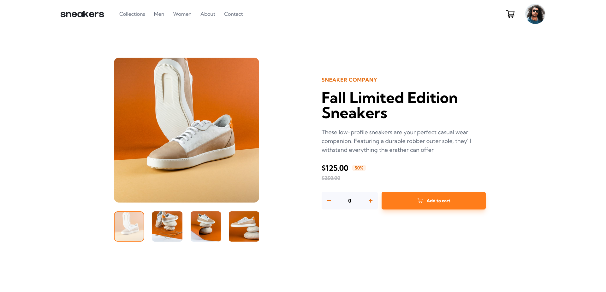

# Frontend Mentor - E-commerce product page solution

This is a solution to the [E-commerce product page challenge on Frontend Mentor](https://www.frontendmentor.io/challenges/ecommerce-product-page-UPsZ9MJp6). Frontend Mentor challenges help you improve your coding skills by building realistic projects.

## Table of contents

- [Overview](#overview)
  - [The challenge](#the-challenge)
  - [Screenshot](#screenshot)
  - [Links](#links)
  - [Built with](#built-with)
  - [What I learned](#what-i-learned)
  - [Useful resources](#useful-resources)
- [Author](#author)

## Overview

### The challenge

Users should be able to:

- View the optimal layout for the site depending on their device's screen size
- See hover states for all interactive elements on the page
- Switch the large product image by clicking on the small thumbnail images
- Add items to the cart
- View the cart and remove items from it

### Screenshot

### Links

- Solution URL: [Solution](https://www.frontendmentor.io/solutions/ecommerce-product-page-w-react-and-tailwindcss-Ox8akvchQS)
- Live Site URL: [Live site](https://ecommerce-product-page-coral-nine.vercel.app/)

### Built with

- Semantic HTML5 markup
- CSS custom properties
- Flexbox
- Mobile-first workflow
- [React](https://reactjs.org/) - JS library
- [TailwindCSS](https://tailwindcss.com/) - For styles

### What I learned

I was able to practice React concepts such as useState, conditional rendering, and how to display data correctly depending on user actions. I was also able to practice my css skills.

### Useful resources

- [Tailwind Color Shades Generator](https://javisperez.github.io/tailwindcolorshades/) - This helped me for create my own custom colors.

## Author

- Website - [Marcos Valentín Fitzsimons](https://marcosfitzsimons-portfolio.vercel.app/)
- Frontend Mentor - [@Marcosfitzsimons](https://www.frontendmentor.io/profile/Marcosfitzsimons)
